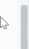

##  Waves UI WPF
WPF UI Kit sources of "Waves".

1. ScrollBar style (animated)

   

2. Text styles
   

3. Button styles
   
   
4. ComboBox styles
   

5. CheckBox styles
   
   
6. RadioButton styles
   
   
7. TextBox styles
   
   
8. ListBox styles
   

9. ProgressBar styles
   
   
10. Menu styles
   
   
11. Chart control
   
   
12. Core logging with UI
   
   
13. Theme change (Accent colors and primary: dark or light)
   
